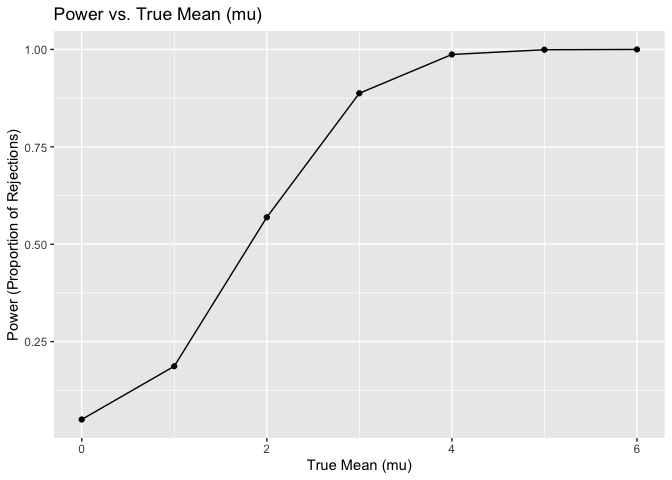

Homework 5
================
Mingyin Wang
2024-11-13

load packages

## Problem 1

Function to check for shared birthdays

``` r
shared_birthday = function(n) {
  birthdays = sample(1:365, n, replace = TRUE)  
  any(duplicated(birthdays))                     
}
```

prbablity of sharing birthdays

``` r
group_sizes = 2:50
num_simulations = 10000

 birthday_results = tibble(
  group_size = group_sizes,
  probability = map_dbl(group_sizes, function(n) {
    mean(replicate(num_simulations, shared_birthday(n)))
  })
)
birthday_results
```

    ## # A tibble: 49 × 2
    ##    group_size probability
    ##         <int>       <dbl>
    ##  1          2      0.0024
    ##  2          3      0.0085
    ##  3          4      0.0167
    ##  4          5      0.0267
    ##  5          6      0.0399
    ##  6          7      0.0521
    ##  7          8      0.0751
    ##  8          9      0.0925
    ##  9         10      0.116 
    ## 10         11      0.139 
    ## # ℹ 39 more rows

plot of Probability of Shared Birthday by Group Size

``` r
ggplot(birthday_results, aes(x = group_size, y = probability)) +
  geom_line() +
  geom_point() +
  labs(
    title = "Probability of Shared Birthday by Group Size",
    x = "Group Size",
    y = "Probability of At Least Two People Sharing a Birthday"
  ) +
  theme_minimal()
```

<!-- -->

The probability of at least two people sharing a birthday rises quickly
with group size, reaching 0.5 by around 23 people. As group size nears
50, the probability approaches 1, making a shared birthday almost
certain.

## Problem 2

Function to simulate data and perform a t-test

``` r
simulate_t_test = function(mu, n = 30, sigma = 5) {
  x = rnorm(n, mean = mu, sd = sigma)
  t_test_result = t.test(x, mu = 0)
  tidy(t_test_result)
}
```

simulation result

``` r
simulation_results = expand_grid(
  mu = 0:6,
  sim = 1:5000
) |>
  mutate(
    test_result = map(mu, ~simulate_t_test(.x))
  ) |>
  unnest_wider(test_result)
```

Calculate power for each mu

``` r
power_results = simulation_results |>
  group_by(mu) |>
  summarize(power = mean(p.value < 0.05))
```

Plot power vs mu

``` r
ggplot(power_results, aes(x = mu, y = power)) +
  geom_line() +
  geom_point() +
  labs(
    title = "Power vs. True Mean (mu)",
    x = "True Mean (mu)",
    y = "Power (Proportion of Rejections)"
  )
```

<!-- --> This
trend demonstrates a positive association between effect size and power.
At lower values of mu, the power is relatively low. When mu reaches
around 4 and higher, the power reaches nearly 1, which means that the
test almost always correctly rejects the null hypothesis for larger
effect sizes.

Calculate average estimate of mu_hat and for rejected samples only

``` r
average_results = 
  simulation_results |>
  group_by(mu) |>
  summarize(
    avg_mu_hat = mean(estimate),
    avg_mu_hat_rejected = mean(estimate[p.value < 0.05])
  )
```

Plot average estimate of mu_hat vs true mu

``` r
ggplot(average_results, aes(x = mu)) +
  geom_line(aes(y = avg_mu_hat), color = "red") +
  geom_point(aes(y = avg_mu_hat), color = "red") +
  geom_line(aes(y = avg_mu_hat_rejected), color = "blue", linetype = "dashed") +
  geom_point(aes(y = avg_mu_hat_rejected), color = "blue") +
  labs(
    title = "Average Estimate of Mu_hat vs True Mu",
    x = "True Mean (mu)",
    y = "Average Estimate of Mu_hat"
  ) +
  theme_minimal()
```

<!-- -->

## Problem 3

read csv file

``` r
homicide_data = read_csv("data/homicide-data.csv")
```

    ## Rows: 52179 Columns: 12
    ## ── Column specification ────────────────────────────────────────────────────────
    ## Delimiter: ","
    ## chr (9): uid, victim_last, victim_first, victim_race, victim_age, victim_sex...
    ## dbl (3): reported_date, lat, lon
    ## 
    ## ℹ Use `spec()` to retrieve the full column specification for this data.
    ## ℹ Specify the column types or set `show_col_types = FALSE` to quiet this message.

The dataset contains data on homicides with 52,179 ros, with 12 columns.
There are some key variables related to homicides in this dataset,
including the date each homicide was reported, the race, age, and sex of
the victim, the city and state where the homicide occurred, and the case
resolution status (e.g., “Closed by arrest,” “Closed without arrest,” or
“Open/No arrest”). These variables provide essential information for
analyzing homicide trends, victim demographics, geographic locations,
and case outcomes.

Create city_state variable and categorize unsolved homicides

``` r
homicide_data = homicide_data |>
  mutate(
    city_state = paste(city, state, sep = ", "),
    unsolved = disposition %in% c("Closed without arrest", "Open/No arrest")
  )
```

Summarize data to get total homicides and unsolved homicides by city

``` r
city_summary = homicide_data |>
  group_by(city_state) |>
  summarize(
    total_homicides = n(),
    unsolved_homicides = sum(unsolved),
    .groups = "drop"
  )
```

do the `prop.test` for Baltimore

``` r
baltimore_summary = homicide_data |>
  filter(city == "Baltimore", state == "MD") |>
  summarize(
    total_homicides = n(),
    unsolved_homicides = sum(disposition %in% c("Closed without arrest", "Open/No arrest"))
  )

baltimore_test = prop.test(baltimore_summary$unsolved_homicides, baltimore_summary$total_homicides) 

tidy_baltimore_test = broom::tidy(baltimore_test)

baltimore_results = tidy_baltimore_test |>
  mutate(
    estimate = as.numeric(estimate),
    conf.low = as.numeric(conf.low),
    conf.high = as.numeric(conf.high),
    city_state = "Baltimore, MD"
  ) |>
  select(city_state, estimate, conf.low, conf.high)
baltimore_results
```

    ## # A tibble: 1 × 4
    ##   city_state    estimate conf.low conf.high
    ##   <chr>            <dbl>    <dbl>     <dbl>
    ## 1 Baltimore, MD    0.646    0.628     0.663

The estimated proportion for Baltimore, MD is 0.6455607. The 95%
confidence interval is between 0.6275625 and 0.6631599.

run `prop.test` for each of the cities in the dataset,

``` r
city_summary = homicide_data |>
  group_by(city, state) |>
  summarize(
    total_homicides = n(),
    unsolved_homicides = sum(disposition %in% c("Closed without arrest", "Open/No arrest")),
    .groups = "drop"
  )

city_test_results <- city_summary %>%
  mutate(
    # Run prop.test using map2 for each city, then tidy the results
    test_result = purrr::map2(unsolved_homicides, total_homicides, ~ tidy(prop.test(.x, .y)))
  ) %>%
  # Unnest to expand the test_result column into individual columns
  unnest(cols = test_result) %>%
  # Create a city_state column for labeling
  mutate(city_state = paste(city, state, sep = ", ")) %>%
  # Select only the desired columns
  select(city_state, estimate, conf.low, conf.high)
```

    ## Warning: There was 1 warning in `mutate()`.
    ## ℹ In argument: `test_result = purrr::map2(...)`.
    ## Caused by warning in `prop.test()`:
    ## ! Chi-squared approximation may be incorrect

``` r
city_test_results
```

    ## # A tibble: 51 × 4
    ##    city_state      estimate conf.low conf.high
    ##    <chr>              <dbl>    <dbl>     <dbl>
    ##  1 Albuquerque, NM    0.386    0.337     0.438
    ##  2 Atlanta, GA        0.383    0.353     0.415
    ##  3 Baltimore, MD      0.646    0.628     0.663
    ##  4 Baton Rouge, LA    0.462    0.414     0.511
    ##  5 Birmingham, AL     0.434    0.399     0.469
    ##  6 Boston, MA         0.505    0.465     0.545
    ##  7 Buffalo, NY        0.612    0.569     0.654
    ##  8 Charlotte, NC      0.300    0.266     0.336
    ##  9 Chicago, IL        0.736    0.724     0.747
    ## 10 Cincinnati, OH     0.445    0.408     0.483
    ## # ℹ 41 more rows

Tulsa, AL is the wrong row, since there is only one Tulsa in OK. Then I
would delete Tulsa, AL row

``` r
city_test_results = city_test_results |>
  filter(city_state != "Tulsa, AL")
city_test_results
```

    ## # A tibble: 50 × 4
    ##    city_state      estimate conf.low conf.high
    ##    <chr>              <dbl>    <dbl>     <dbl>
    ##  1 Albuquerque, NM    0.386    0.337     0.438
    ##  2 Atlanta, GA        0.383    0.353     0.415
    ##  3 Baltimore, MD      0.646    0.628     0.663
    ##  4 Baton Rouge, LA    0.462    0.414     0.511
    ##  5 Birmingham, AL     0.434    0.399     0.469
    ##  6 Boston, MA         0.505    0.465     0.545
    ##  7 Buffalo, NY        0.612    0.569     0.654
    ##  8 Charlotte, NC      0.300    0.266     0.336
    ##  9 Chicago, IL        0.736    0.724     0.747
    ## 10 Cincinnati, OH     0.445    0.408     0.483
    ## # ℹ 40 more rows

Plot the results

``` r
ggplot(city_test_results, aes(x = reorder(city_state, estimate), y = estimate)) +
  geom_point() +
  geom_errorbar(aes(ymin = conf.low, ymax = conf.high), width = 0.2) +
  coord_flip() +
  labs(
    title = "Proportion of Unsolved Homicides by City",
    x = "City",
    y = "Estimated Proportion of Unsolved Homicides"
  ) +
  theme_minimal()
```

<!-- --> The plot
shows estimated unsolved homicide proportions across cities, ordered by
proportion. Points represent estimates, and error bars indicate 95%
confidence intervals. Most cities fall between 0.3 and 0.6, with a few
outliers at low or high proportions.
